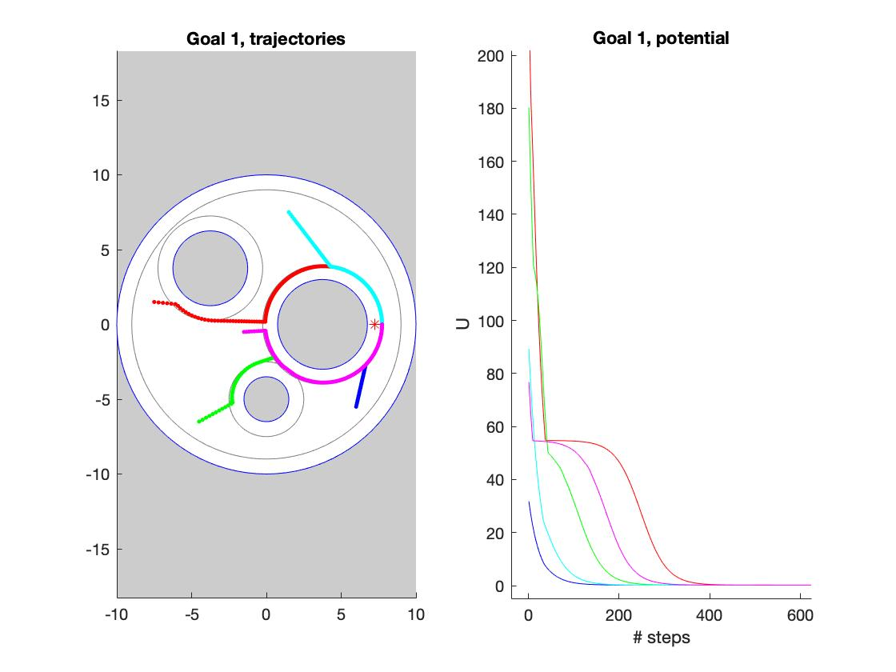
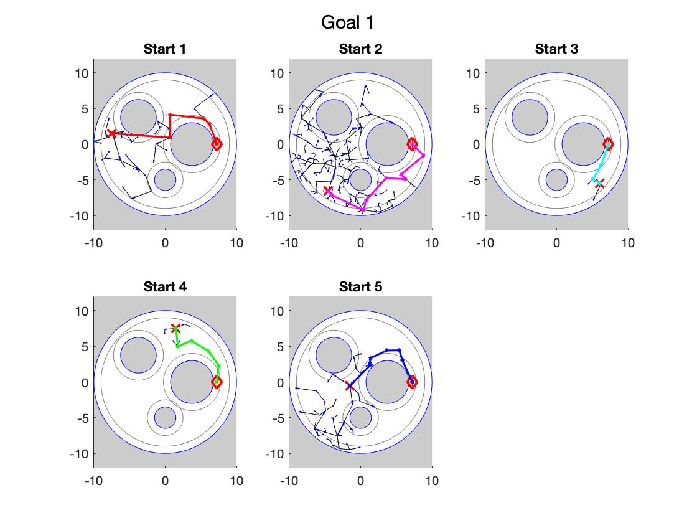
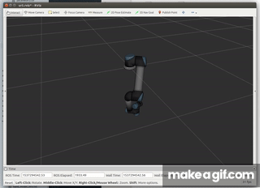

 | | | 
| ---| ---| 
| Potential-based  | CLF-CBF <ME570_Robot_Motion_Planning/imgs/CLF_CBF.jpg" width=300> | 
|A* <ME570_Robot_Motion_Planning/imgs/A_star.jpg" height=150 width=150> | Sampling tree  |
|A* <MECSE4603_Applied_Robotics/imgs/fwk_lwr.png" height=150 width=150> | Sampling tree  |

# MotionPlanning_assignments
This repository contains the assignments of Motion Planning course. Each folder contains the homework instruction (pdf file) and my Matlab implementation for the final report.

1. Assignment 1
   - Problem 1: Drawing, visibility and collisions for 2-D polygons
   - Problem 2: Poor-man’s priority queue
   - Problem 2: Problem 3: Using CVX to solve convex optimization problems

2. Assignment 2
   - Problem 1: Rotations
   - Problem 2: Free configuration space for a two-link manipulator
   - Problem 3: Grids, function handles, and evaluating functions on grids
   - Problem 4: Charts for the circle using rotations
   - Problem 5: Charts for the torus using rotations
   - Problem 6: Jacobians and end effector velocities

3. Assignment 3
   - Problem 1: Drawing and collision checking for spheres
   - Problem 2: The potential-based planner
   - Problem 3: CLF-CBF formulation
   - Problem 4: Jacobian-based Inverse Kinematics (IK) for the two-link manipulator

4. Assignment 4
   - Problem 0: Graph data structure and utilities
   - Problem 1: Graph search
   - Problem 2: Application of A* to the sphere world
   - Problem 3: Application of A* to the two-link manipulator

5. Assignment 5
   - Problem 1: Sampling tree

# AppliedRobotics_assignments
This repository contains the assignments of Applied Robotics course. Each folder contains the homework instruction (md file) and my ROS/Python implementation.
1. Assignment 1: Transformation
2. Assignment 2: Forward Kinematics on Kuka LWR and Universal UR5
3. Assignment 3: Cartesian Control and Numerical IK on Kuka LWR and Universal UR5
4. Assignment 4: RRT algorithm for sampling-based motion planning on Kuka LWR
5. Assignment 5: Extended Kalman Filter with GUI
