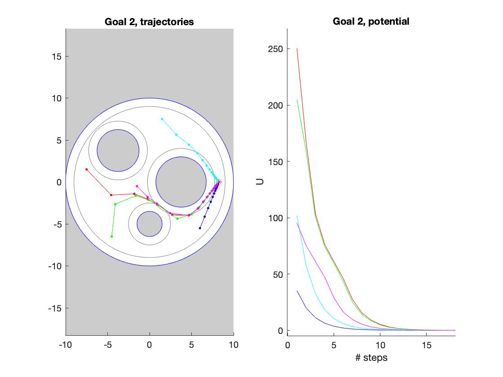

# Roadmap to Motion Planning in Robotics 
I got familiar with motion planning methods, including Potential-Field(PF)-based planner, Control Lyapunov Function(CLF)-Control Barrier Function(CBF), A star,  Probabilistic RoadMaps(PRM), Rapidly-Exploring Random Trees(RRT) and Expansive-Spaces Tree planner (EST) from the [motion planning course](https://github.com/heyday1006/Motion_Planning_Study/tree/main/ME570_Robot_Motion_Planning/readme.md) and [applied robotics course](https://github.com/heyday1006/Motion_Planning_Study/tree/main/MECSE4603_Applied_Robotics/readme.md) I took, from where I used Matlab, Python and ROS to apply the algorithms to mobile robots and robotic arms.
 | | | 
| :-:| :-:| 
| Potential-based   | CLF-CBF   | 
|A*   | EST   |
|Kuka LWR   | Universal UR5   |
